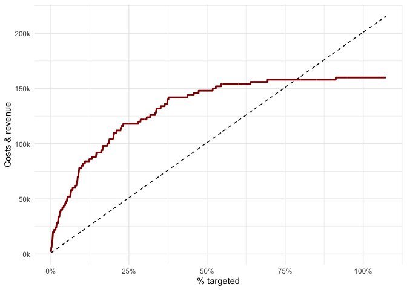
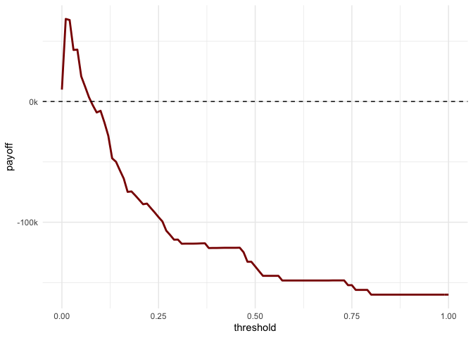

<!-- README.md is generated from README.Rmd. Please edit that file -->

# modelimpact

<!-- badges: start -->

[](https://github.com/PeerChristensen/modelimpact/actions)
[](https://CRAN.R-project.org/package=modelimpact)
<!-- badges: end -->

This package is intended to help data scientists and decision-makers
understand the potential value of churn prediction models depending on
how many customers are being targeted by a campaign.

## Installation

You can install the development version from
[GitHub](https://github.com/) with:

``` r
# install.packages("devtools")
devtools::install_github("PeerChristensen/modelimpact")
```

## Functions and parameters

The first three functions aim to provide information about the business
impact of using a model and targeting x % of the customer base. These
functions accept the following arguments (required ones in **bold**):
<br>

-   **`x`** - a data frame <br>
-   `fixed_cost` - fixed costs (defaults to 0) <br>
-   `var_cost` - variable costs (defaults to 0) <br>
-   `tp_val` - true positive value (defaults to 0) <br>
-   **`prob_col`** - the variable containing target class probabilities
-   **`truth_col`** the variable containing the actual class

`profit_thresholds()` accepts the following arguments:

-   **`x`** - a data frame <br>
-   `var_cost` - variable costs <br>
-   `prob_accept` - Probability of offer being accepted. Defaults to 1.
    <br>
-   `tp_val` - The average value of a True Positive. `var_cost` is
    automatically subtracted. <br>
-   `fp_val` - The average cost of a False Positive. `var_cost` is
    automatically subtracted. <br>
-   `tn_val` - The average cost of a True Negatives <br>
-   `fn_val` - The average cost of a False Negatives <br>
-   **`prob_col`** - The column with probabilities of the event of
    interest <br>
-   **`truth_col`** - the column with the actual outcome/class. Possible
    values are ‘Yes’ and ‘No’

``` r
# Parameter settings
fixed_cost <- 1000
var_cost   <- 100
tp_val     <- 2000
```

## Costs and revenue

``` r
library(modelimpact)
library(tidyverse)
library(scales)

head(predictions)
#> # A tibble: 6 x 4
#>   predict    No     Yes Churn
#>   <chr>   <dbl>   <dbl> <chr>
#> 1 No      0.996 0.00353 No   
#> 2 No      0.983 0.0166  No   
#> 3 No      0.993 0.00705 No   
#> 4 No      0.981 0.0187  No   
#> 5 No      0.894 0.106   No   
#> 6 No      0.997 0.00254 No
```

``` r
cost_rev <- predictions %>%
  cost_revenue(
    fixed_cost = fixed_cost,
    var_cost   = var_cost,
    tp_val     = tp_val,
    prob_col   = Yes,
    truth_col  = Churn)

head(cost_rev)
#> # A tibble: 6 x 4
#>     row   pct cost_sum cum_rev
#>   <int> <int>    <dbl>   <dbl>
#> 1     1     1     1100    2000
#> 2     2     1     1200    4000
#> 3     3     1     1300    6000
#> 4     4     1     1400    6000
#> 5     5     1     1500    6000
#> 6     6     1     1600    8000
```

``` r
# functions for formatting plotting axes
ks <- function (x) { number_format(accuracy = 1,
                                   scale = 1/1000,
                                   suffix = "k",
                                   big.mark = ",")(x) }

pcts <- function (x) { percent_format(scale=1)((x / max(x)) * 100) }
theme_set(theme_minimal())

cost_rev %>%
  ggplot() +
  geom_line(aes(row,cost_sum), colour ="black",linetype="dashed") + 
  geom_line(aes(row,cum_rev), colour = "darkred",size=1) + 
  scale_y_continuous(labels = ks) +
  scale_x_continuous(labels = pcts) +
  labs(x = "% targeted",y = "Costs & revenue")
```



## Profit

``` r
profit_df <- predictions %>%
  profit(
    fixed_cost = fixed_cost,
    var_cost   = var_cost,
    tp_val     = tp_val,
    prob_col   = Yes,
    truth_col  = Churn)

head(profit_df)
#> # A tibble: 6 x 3
#>     row   pct profit
#>   <int> <int>  <dbl>
#> 1     1     1    900
#> 2     2     1   2800
#> 3     3     1   4700
#> 4     4     1   4600
#> 5     5     1   4500
#> 6     6     1   6400
```

``` r
# max profit
max_profit <- profit_df %>% filter(profit == max(profit)) %>% select(row,pct,profit)

max_profit
#> # A tibble: 1 x 3
#>     row   pct profit
#>   <int> <int>  <dbl>
#> 1   464    22  70600
```

``` r
profit_df %>%
  ggplot(aes(x=row,y=profit)) +
  geom_line(colour = "darkred",size=1) +
  scale_y_continuous(labels = ks) +
  geom_segment(x = max_profit$row, y= 0,xend=max_profit$row,
             yend = max_profit$profit, colour="black",linetype="dashed") +
  geom_hline(yintercept = 0,colour="black", linetype="dashed") +
  scale_x_continuous(labels = pcts) +
  labs(x = "% targeted",y = "Profit")
```


## Return on investment

``` r
roi_df <- predictions %>%
  roi(
    fixed_cost = fixed_cost,
    var_cost   = var_cost,
    tp_val     = tp_val,
    prob_col   = Yes,
    truth_col  = Churn)

head(roi_df)
#> # A tibble: 6 x 5
#>     row   pct cum_rev cost_sum   roi
#>   <int> <int>   <dbl>    <dbl> <dbl>
#> 1     1     1    2000     1100 0.818
#> 2     2     1    4000     1200 2.33 
#> 3     3     1    6000     1300 3.62 
#> 4     4     1    6000     1400 3.29 
#> 5     5     1    6000     1500 3    
#> 6     6     1    8000     1600 4
```

``` r
roi_df %>%
  ggplot(aes(x=row,y=roi)) +
  geom_hline(yintercept = 0,colour="black", linetype="dashed") +
  geom_line(colour = "darkred",size=1) +
  scale_x_continuous(labels = pcts) +
  labs(x = "% targeted",y = "ROI")
```


## Optimal threshold

``` r
thresholds <- predictions %>%
  profit_thresholds(var_cost    = 100,
                    prob_accept = .7,
                    tp_val      = 2000,
                    fp_val      = 0,
                    tn_val      = 0,
                    fn_val      = -2000,
                    prob_col = Yes,
                    truth_col = Churn)

head(thresholds)
#> # A tibble: 6 x 2
#>   threshold payoff
#>       <dbl>  <dbl>
#> 1      0      9850
#> 2      0.01  68400
#> 3      0.02  67500
#> 4      0.03  42700
#> 5      0.04  42960
#> 6      0.05  20840
```

``` r
optimal_threshold <- thresholds %>% filter(payoff == max(payoff))
optimal_threshold
#> # A tibble: 1 x 2
#>   threshold payoff
#>       <dbl>  <dbl>
#> 1      0.01  68400
```

``` r
thresholds %>%
  ggplot(aes(x=threshold,y=payoff)) +
  geom_line(color="darkred",size = 1) +
  geom_hline(yintercept=0,linetype="dashed") +
  scale_y_continuous(labels = ks)
```


